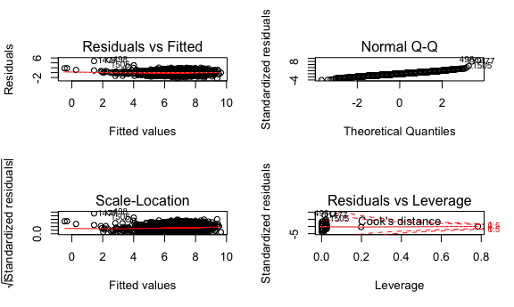

p8105\_hw6\_bs3142
================
Bingyu Sun
11/19/2018

Problem 1
---------

### Data Import & Cleaning

-   **Create a city\_state variable (e.g. “Baltimore, MD”), and a binary variable indicating whether the homicide is solved. Omit cities Dallas, TX; Phoenix, AZ; and Kansas City, MO – these don’t report victim race. Also omit Tulsa, AL – this is a data entry mistake. Modifiy victim\_race to have categories white and non-white, with white as the reference category. Be sure that victim\_age is numeric.**

``` r
homicides_data =
  read_csv("./data/homicide-data.csv", na = c("", "NA", "Unknown")) %>%
  na.omit() %>%
  mutate(city_state = str_c(city, state, sep = ", ")) %>%
  filter(!(city_state %in% c("Dallas, TX", "Phoenix, AZ", "Kansas City, MO", "Tulsa, AL"))) %>%
  mutate(
    resolved = as.numeric(disposition == "Closed by arrest"),
    victim_age = as.numeric(victim_age),
    victim_race = ifelse(victim_race == "White", "white", "non-white"),
    victim_race = fct_relevel(victim_race, "white")
  )
## Parsed with column specification:
## cols(
##   uid = col_character(),
##   reported_date = col_integer(),
##   victim_last = col_character(),
##   victim_first = col_character(),
##   victim_race = col_character(),
##   victim_age = col_integer(),
##   victim_sex = col_character(),
##   city = col_character(),
##   state = col_character(),
##   lat = col_double(),
##   lon = col_double(),
##   disposition = col_character()
## )
```

### Q & A

**1. For the city of Baltimore, MD, use the glm function to fit a logistic regression with resolved vs unresolved as the outcome and victim age, sex and race (as just defined) as predictors. Save the output of glm as an R object; apply the broom::tidy to this object.**

``` r
fit_logistic_baltimore =
  homicides_data %>%
  filter(city_state == "Baltimore, MD") %>%
  select(resolved, victim_age, victim_sex, victim_race) %>%
  glm(resolved ~ victim_age + victim_sex + victim_race, data = ., family = binomial()) 

fit_logistic_baltimore %>%
  broom::tidy()
## # A tibble: 4 x 5
##   term                 estimate std.error statistic  p.value
##   <chr>                   <dbl>     <dbl>     <dbl>    <dbl>
## 1 (Intercept)           1.19      0.235        5.06 4.30e- 7
## 2 victim_age           -0.00699   0.00326     -2.14 3.22e- 2
## 3 victim_sexMale       -0.888     0.136       -6.53 6.80e-11
## 4 victim_racenon-white -0.820     0.175       -4.69 2.68e- 6
```

**2. Obtain the estimate and confidence interval of the adjusted odds ratio for solving homicides comparing non-white victims to white victims keeping all other variables fixed.**

``` r
fit_logistic_baltimore %>%
  broom::tidy(conf.int = TRUE) %>%
  mutate(OR = exp(estimate)) %>%
  select(term, OR, log_OR = estimate, starts_with("conf")) %>%
  filter(term == "victim_racenon-white")
## # A tibble: 1 x 5
##   term                    OR log_OR conf.low conf.high
##   <chr>                <dbl>  <dbl>    <dbl>     <dbl>
## 1 victim_racenon-white 0.441 -0.820    -1.16    -0.479
```

**3. Now run glm for each of the cities in your dataset, and extract the adjusted odds ratio (and CI) for solving homicides comparing non-white victims to white victims. Do this within a “tidy” pipeline, making use of purrr::map, list columns, and unnest as necessary to create a dataframe with estimated ORs and CIs for each city.**

``` r
tidy = function(df) {
  broom::tidy(df, conf.int = TRUE)
}

homicides_statistics =
  homicides_data %>%
  group_by(city_state) %>%
  nest() %>% 
  mutate(
    fit_model = map(.x = data, ~glm(resolved ~ victim_age + victim_sex + victim_race, data = .x, family = binomial())),
    fit_model = map(fit_model, tidy)
    ) %>%
  select(-data) %>%
  unnest() %>%
  mutate(OR = exp(estimate)) %>%
  select(city_state, term, OR, log_OR = estimate, starts_with("conf")) %>%
  filter(term == "victim_racenon-white")
```

**4. Create a plot that shows the estimated ORs and CIs for each city. Organize cities according to estimated OR, and comment on the plot.**

``` r
homicides_statistics %>%
  mutate(city_state = fct_reorder(city_state, log_OR)) %>%
  ggplot(aes(x = city_state, y = log_OR)) +
  geom_point() +
  geom_errorbar(aes(ymin = conf.low, ymax = conf.high)) + 
  theme(axis.text.x = element_text(angle = 90, hjust = 1))
```



**Comment:**

Problem 2
---------
