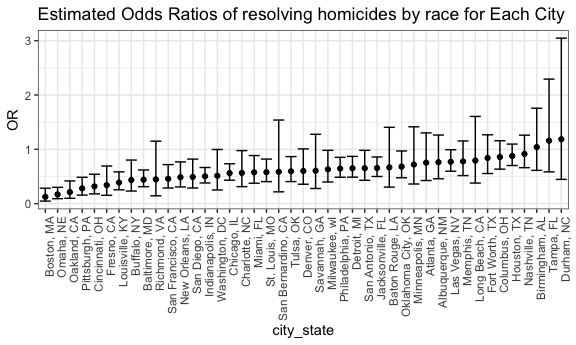
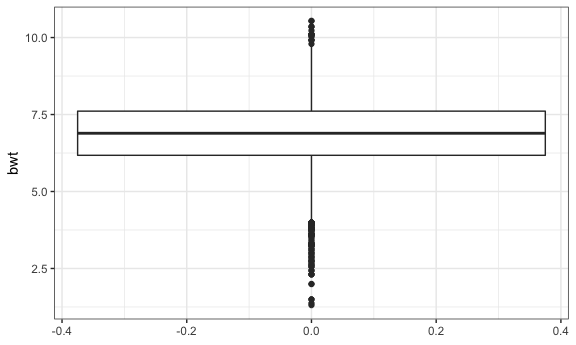
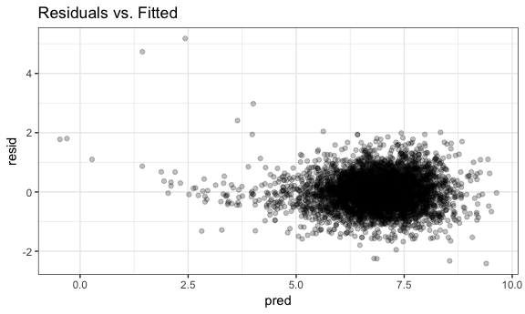

p8105\_hw6\_bs3142
================
Bingyu Sun
11/19/2018

Problem 1
---------

### Data Import & Cleaning

-   **Create a city\_state variable (e.g. “Baltimore, MD”), and a binary variable indicating whether the homicide is solved. Omit cities Dallas, TX; Phoenix, AZ; and Kansas City, MO – these don’t report victim race. Also omit Tulsa, AL – this is a data entry mistake. Modifiy victim\_race to have categories white and non-white, with white as the reference category. Be sure that victim\_age is numeric.**

``` r
homicides_data =
  read_csv("./data/homicide-data.csv", na = c("", "NA", "Unknown")) %>%
  na.omit() %>% #filter out NAs
  mutate(city_state = str_c(city, state, sep = ", ")) %>% #add a new column
  filter(!city_state %in% c("Dallas, TX", "Phoenix, AZ", "Kansas City, MO", "Tulsa, AL")) %>% #filter out some cities
  mutate(
    resolved = as.numeric(disposition == "Closed by arrest"),
    victim_age = as.numeric(victim_age),
    victim_race = ifelse(victim_race == "White", "white", "non-white"),
    victim_race = fct_relevel(victim_race, "white")
  ) #redefine some variables
## Parsed with column specification:
## cols(
##   uid = col_character(),
##   reported_date = col_integer(),
##   victim_last = col_character(),
##   victim_first = col_character(),
##   victim_race = col_character(),
##   victim_age = col_integer(),
##   victim_sex = col_character(),
##   city = col_character(),
##   state = col_character(),
##   lat = col_double(),
##   lon = col_double(),
##   disposition = col_character()
## )
```

### Q & A

**1. For the city of Baltimore, MD, use the glm function to fit a logistic regression with resolved vs unresolved as the outcome and victim age, sex and race (as just defined) as predictors. Save the output of glm as an R object; apply the broom::tidy to this object.**

``` r
fit_logistic_baltimore =
  homicides_data %>%
  filter(city_state == "Baltimore, MD") %>%
  glm(resolved ~ victim_age + victim_sex + victim_race, data = ., family = binomial()) #get regression object

fit_logistic_baltimore %>%
  broom::tidy() %>% #get log odds ratio
  knitr::kable(digits = 3)
```

| term                  |  estimate|  std.error|  statistic|  p.value|
|:----------------------|---------:|----------:|----------:|--------:|
| (Intercept)           |     1.186|      0.235|      5.055|    0.000|
| victim\_age           |    -0.007|      0.003|     -2.142|    0.032|
| victim\_sexMale       |    -0.888|      0.136|     -6.525|    0.000|
| victim\_racenon-white |    -0.820|      0.175|     -4.694|    0.000|

**2. Obtain the estimate and confidence interval of the adjusted odds ratio for solving homicides comparing non-white victims to white victims keeping all other variables fixed.**

``` r
fit_logistic_baltimore %>%
  broom::tidy(conf.int = TRUE) %>% #get CI
  mutate(OR = exp(estimate),
         conf.low = exp(conf.low),
         conf.high = exp(conf.high)) %>% #transform to orginal scale
  select(term, log_OR = estimate, OR, starts_with("conf")) %>%
  filter(term == "victim_racenon-white") %>%
  knitr::kable(digits = 3)
```

| term                  |  log\_OR|     OR|  conf.low|  conf.high|
|:----------------------|--------:|------:|---------:|----------:|
| victim\_racenon-white |    -0.82|  0.441|     0.312|       0.62|

**Comment:**

In baltimore, the odds of resolving cases for non-white people is 0.441 as likely as compares to white people adjusting for age and sex. At alpha = 0.05, we are 95% confident that the true odds ratio of resolving cases for non-white people is between 0.312 and 0.620.

**3. Now run glm for each of the cities in your dataset, and extract the adjusted odds ratio (and CI) for solving homicides comparing non-white victims to white victims. Do this within a “tidy” pipeline, making use of purrr::map, list columns, and unnest as necessary to create a dataframe with estimated ORs and CIs for each city.**

``` r
tidy = function(df) {
  broom::tidy(df, conf.int = TRUE)
} #get summary with CI

homicides_statistics =
  homicides_data %>%
  group_by(city_state) %>%
  nest() %>% #nest by city_state
  mutate(
    fit_model = map(.x = data, ~glm(resolved ~ victim_age + victim_sex + victim_race, data = .x, family = binomial())),
    fit_model = map(fit_model, tidy)
    ) %>% #fit model for each city
  select(-data) %>%
  unnest() %>%
  filter(term == "victim_racenon-white") %>% #get term of interest
  mutate(OR = exp(estimate),
         conf.low = exp(conf.low),
         conf.high = exp(conf.high)) %>% #transform to original scale
  select(city_state, term, OR, starts_with("conf")) %>% #select variables of interest
  mutate(term = str_replace(term, "victim_race", "victim race: ")) #formatting
```

**4. Create a plot that shows the estimated ORs and CIs for each city. Organize cities according to estimated OR, and comment on the plot.**

``` r
homicides_statistics %>%
  mutate(city_state = fct_reorder(city_state, OR)) %>% #order by OR
  ggplot(aes(x = city_state, y = OR)) +
  geom_point() +
  geom_errorbar(aes(ymin = conf.low, ymax = conf.high)) + 
  labs(title = "Estimated Odds Ratios of resolving homicides by race for Each City") +
  theme(axis.text.x = element_text(angle = 90, hjust = 1)) #scatterplot with error bar
```



**Comment:**

The majority of cities in U.S. demonstate a better odds of solving cases in white victims than non-white victims. In general, the estimated odds ratios of resolving cases in non-white victims compares to white victims have wide confidence interval.

Problem 2
---------

### Data Import & Cleaning

-   **Load and clean the data for regression analysis (i.e. convert numeric to factor where appropriate, check for missing data, etc.).**

``` r
bwt_data =
  read_csv("./data/birthweight.csv", col_types = "dddddddddddddddddddd") %>%
  mutate(babysex = as.factor(babysex),
         frace = as.factor(frace),
         malform = as.factor(malform),
         mrace = as.factor(mrace),
         bwt = bwt * 0.0022) %>% #gram to pound
  select(bwt, everything(), -pnumlbw, -pnumsga)

str(bwt_data)
## Classes 'tbl_df', 'tbl' and 'data.frame':    4342 obs. of  18 variables:
##  $ bwt     : num  7.98 6.74 7.36 6.74 7.42 ...
##  $ babysex : Factor w/ 2 levels "1","2": 2 1 2 1 2 1 2 2 1 1 ...
##  $ bhead   : num  34 34 36 34 34 33 33 33 36 33 ...
##  $ blength : num  51 48 50 52 52 52 46 49 52 50 ...
##  $ delwt   : num  177 156 148 157 156 129 126 140 146 169 ...
##  $ fincome : num  35 65 85 55 5 55 96 5 85 75 ...
##  $ frace   : Factor w/ 5 levels "1","2","3","4",..: 1 2 1 1 1 1 2 1 1 2 ...
##  $ gaweeks : num  39.9 25.9 39.9 40 41.6 ...
##  $ malform : Factor w/ 2 levels "0","1": 1 1 1 1 1 1 1 1 1 1 ...
##  $ menarche: num  13 14 12 14 13 12 14 12 11 12 ...
##  $ mheight : num  63 65 64 64 66 66 72 62 61 64 ...
##  $ momage  : num  36 25 29 18 20 23 29 19 13 19 ...
##  $ mrace   : Factor w/ 4 levels "1","2","3","4": 1 2 1 1 1 1 2 1 1 2 ...
##  $ parity  : num  3 0 0 0 0 0 0 0 0 0 ...
##  $ ppbmi   : num  26.3 21.3 23.6 21.8 21 ...
##  $ ppwt    : num  148 128 137 127 130 115 105 119 105 145 ...
##  $ smoken  : num  0 0 1 10 1 0 0 0 0 4 ...
##  $ wtgain  : num  29 28 11 30 26 14 21 21 41 24 ...
skimr::skim(bwt_data)
## Skim summary statistics
##  n obs: 4342 
##  n variables: 18 
## 
## ── Variable type:factor ────────────────────────────────────────────────────────────
##  variable missing complete    n n_unique                      top_counts
##   babysex       0     4342 4342        2         1: 2230, 2: 2112, NA: 0
##     frace       0     4342 4342        5 1: 2123, 2: 1911, 4: 248, 3: 46
##   malform       0     4342 4342        2           0: 4327, 1: 15, NA: 0
##     mrace       0     4342 4342        4 1: 2147, 2: 1909, 4: 243, 3: 43
##  ordered
##    FALSE
##    FALSE
##    FALSE
##    FALSE
## 
## ── Variable type:numeric ───────────────────────────────────────────────────────────
##  variable missing complete    n     mean    sd     p0    p25    p50    p75
##     bhead       0     4342 4342  33.65    1.62  21     33     34     35   
##   blength       0     4342 4342  49.75    2.72  20     48     50     51   
##       bwt       0     4342 4342   6.85    1.13   1.31   6.18   6.89   7.61
##     delwt       0     4342 4342 145.57   22.21  86    131    143    157   
##   fincome       0     4342 4342  44.11   25.98   0     25     35     65   
##   gaweeks       0     4342 4342  39.43    3.15  17.7   38.3   39.9   41.1 
##  menarche       0     4342 4342  12.51    1.48   0     12     12     13   
##   mheight       0     4342 4342  63.49    2.66  48     62     63     65   
##    momage       0     4342 4342  20.3     3.88  12     18     20     22   
##    parity       0     4342 4342   0.0023  0.1    0      0      0      0   
##     ppbmi       0     4342 4342  21.57    3.18  13.07  19.53  21.03  22.91
##      ppwt       0     4342 4342 123.49   20.16  70    110    120    134   
##    smoken       0     4342 4342   4.15    7.41   0      0      0      5   
##    wtgain       0     4342 4342  22.08   10.94 -46     15     22     28   
##    p100     hist
##   41    ▁▁▁▁▅▇▁▁
##   63    ▁▁▁▁▁▇▁▁
##   10.54 ▁▁▁▃▇▇▂▁
##  334    ▁▇▅▁▁▁▁▁
##   96    ▁▂▇▂▂▂▁▃
##   51.3  ▁▁▁▁▃▇▁▁
##   19    ▁▁▁▁▂▇▁▁
##   77    ▁▁▁▅▇▂▁▁
##   44    ▂▇▅▂▁▁▁▁
##    6    ▇▁▁▁▁▁▁▁
##   46.1  ▁▇▅▁▁▁▁▁
##  287    ▁▇▆▁▁▁▁▁
##   60    ▇▁▁▁▁▁▁▁
##   89    ▁▁▁▇▇▁▁▁
```

**Comment:** There are 4342 rows by 20 columns with no missing value in the dataset. Each row represents a baby's information. Previous number of low birth weight babies (pnumlbw) and number of prior small for gestational age babies (pnumgsa) are removed from the data because they only consist of zeros.

### Q & A

**1. Propose a regression model for birthweight. This model may be based on a hypothesized structure for the factors that underly birthweight, on a data-driven model-building process, or a combination of the two. Describe your modeling process.**

**Look at the data**

``` r
bwt_data %>%
  select(-babysex, -frace, -malform, -mrace) %>%
  cor() #check correlation
##                   bwt        bhead     blength        delwt      fincome
## bwt       1.000000000  0.747106776  0.74345075  0.287889306  0.154571511
## bhead     0.747106776  1.000000000  0.63045480  0.214370719  0.115699146
## blength   0.743450753  0.630454800  1.00000000  0.229149444  0.078745057
## delwt     0.287889306  0.214370719  0.22914944  1.000000000  0.034994354
## fincome   0.154571511  0.115699146  0.07874506  0.034994354  1.000000000
## gaweeks   0.412183348  0.378456488  0.35926367  0.124278465  0.106677673
## menarche -0.024424664 -0.003016051 -0.02106739 -0.085940103 -0.003535085
## mheight   0.192163204  0.116948174  0.16025985  0.411257622  0.131018596
## momage    0.135773400  0.108081296  0.08016031  0.074040925  0.323114207
## parity   -0.008374112 -0.020039523 -0.03247008 -0.004709123 -0.025942406
## ppbmi     0.093945729  0.086556495  0.07401577  0.720504055 -0.020189000
## ppwt      0.182891964  0.136608829  0.14860464  0.870913274  0.047252637
## smoken   -0.075627807 -0.053947231 -0.06562883  0.048612734  0.077943047
## wtgain    0.247252588  0.183333740  0.19122376  0.424788310 -0.016037706
##                gaweeks      menarche     mheight      momage       parity
## bwt       0.4121833483 -0.0244246642  0.19216320  0.13577340 -0.008374112
## bhead     0.3784564882 -0.0030160515  0.11694817  0.10808130 -0.020039523
## blength   0.3592636747 -0.0210673863  0.16025985  0.08016031 -0.032470081
## delwt     0.1242784648 -0.0859401032  0.41125762  0.07404092 -0.004709123
## fincome   0.1066776727 -0.0035350852  0.13101860  0.32311421 -0.025942406
## gaweeks   1.0000000000 -0.0004362693  0.06213774  0.11390983 -0.079658854
## menarche -0.0004362693  1.0000000000  0.07411557  0.17603797  0.019476194
## mheight   0.0621377387  0.0741155687  1.00000000  0.10904804 -0.013423739
## momage    0.1139098271  0.1760379749  0.10904804  1.00000000  0.051954243
## parity   -0.0796588545  0.0194761938 -0.01342374  0.05195424  1.000000000
## ppbmi     0.0273358740 -0.1218260802 -0.10073775  0.08124512 -0.005926674
## ppwt      0.0564730379 -0.0704995875  0.42668724  0.12959210 -0.011202947
## smoken    0.0362116820  0.0163746450  0.06098352  0.07545435 -0.005575698
## wtgain    0.1481459581 -0.0445137226  0.04847893 -0.08848760  0.011081927
##                 ppbmi        ppwt       smoken      wtgain
## bwt       0.093945729  0.18289196 -0.075627807  0.24725259
## bhead     0.086556495  0.13660883 -0.053947231  0.18333374
## blength   0.074015773  0.14860464 -0.065628829  0.19122376
## delwt     0.720504055  0.87091327  0.048612734  0.42478831
## fincome  -0.020189000  0.04725264  0.077943047 -0.01603771
## gaweeks   0.027335874  0.05647304  0.036211682  0.14814596
## menarche -0.121826080 -0.07049959  0.016374645 -0.04451372
## mheight  -0.100737749  0.42668724  0.060983516  0.04847893
## momage    0.081245123  0.12959210  0.075454350 -0.08848760
## parity   -0.005926674 -0.01120295 -0.005575698  0.01108193
## ppbmi     1.000000000  0.85331676  0.007022980 -0.10992958
## ppwt      0.853316763  1.00000000  0.038854748 -0.07494032
## smoken    0.007022980  0.03885475  1.000000000  0.02706577
## wtgain   -0.109929577 -0.07494032  0.027065774  1.00000000
```

-   Baby's head circumference at birth (bhead), baby's length at birth (blength), and baby's birth weight (bwt) are highly correlated (&gt;0.7).

-   Mother's pre-pregnancy BMI (ppbmi), mother's pre-pregnancy weight (ppwt), and mother's weight at delivery (delwt) are highly correlated (&gt;0.7).

**Look at the outcome distribution**

``` r
bwt_data %>%
  select(bwt) %>%
  ggplot(aes(y = bwt)) + geom_boxplot()
```



``` r

bwt_data %>%
  select(bwt) %>%
  ggplot(aes(x = bwt)) + geom_histogram()
## `stat_bin()` using `bins = 30`. Pick better value with `binwidth`.
```


-   Birthweight has approximately normal distribution.

**Use stepwise approach to get the model**

``` r
fit_all = lm(bwt ~ ., data = bwt_data)

step(fit_all, direction = 'backward') #stepwise approach
## Start:  AIC=-4422.15
## bwt ~ babysex + bhead + blength + delwt + fincome + frace + gaweeks + 
##     malform + menarche + mheight + momage + mrace + parity + 
##     ppbmi + ppwt + smoken + wtgain
## 
## 
## Step:  AIC=-4422.15
## bwt ~ babysex + bhead + blength + delwt + fincome + frace + gaweeks + 
##     malform + menarche + mheight + momage + mrace + parity + 
##     ppbmi + ppwt + smoken
## 
##            Df Sum of Sq    RSS     AIC
## - frace     4      0.60 1552.9 -4428.5
## - malform   1      0.01 1552.3 -4424.1
## - ppbmi     1      0.03 1552.3 -4424.1
## - momage    1      0.14 1552.4 -4423.8
## - mheight   1      0.32 1552.6 -4423.2
## - menarche  1      0.54 1552.8 -4422.6
## - ppwt      1      0.63 1552.9 -4422.4
## <none>                  1552.3 -4422.2
## - fincome   1      0.94 1553.2 -4421.5
## - parity    1      2.00 1554.3 -4418.6
## - mrace     3      4.20 1556.5 -4416.4
## - babysex   1      4.13 1556.4 -4412.6
## - gaweeks   1     22.32 1574.6 -4362.2
## - smoken    1     24.57 1576.9 -4356.0
## - delwt     1     38.76 1591.1 -4317.1
## - blength   1    493.92 2046.2 -3224.6
## - bhead     1    515.63 2067.9 -3178.8
## 
## Step:  AIC=-4428.47
## bwt ~ babysex + bhead + blength + delwt + fincome + gaweeks + 
##     malform + menarche + mheight + momage + mrace + parity + 
##     ppbmi + ppwt + smoken
## 
##            Df Sum of Sq    RSS     AIC
## - malform   1      0.01 1552.9 -4430.5
## - ppbmi     1      0.03 1552.9 -4430.4
## - momage    1      0.14 1553.0 -4430.1
## - mheight   1      0.34 1553.2 -4429.5
## - menarche  1      0.56 1553.5 -4428.9
## - ppwt      1      0.65 1553.6 -4428.7
## <none>                  1552.9 -4428.5
## - fincome   1      0.94 1553.8 -4427.8
## - parity    1      2.01 1554.9 -4424.9
## - babysex   1      4.12 1557.0 -4419.0
## - gaweeks   1     22.39 1575.3 -4368.3
## - smoken    1     24.38 1577.3 -4362.8
## - delwt     1     38.78 1591.7 -4323.4
## - mrace     3     65.54 1618.4 -4255.0
## - blength   1    493.66 2046.6 -3231.9
## - bhead     1    516.25 2069.2 -3184.3
## 
## Step:  AIC=-4430.45
## bwt ~ babysex + bhead + blength + delwt + fincome + gaweeks + 
##     menarche + mheight + momage + mrace + parity + ppbmi + ppwt + 
##     smoken
## 
##            Df Sum of Sq    RSS     AIC
## - ppbmi     1      0.03 1553.0 -4432.4
## - momage    1      0.14 1553.0 -4432.1
## - mheight   1      0.34 1553.2 -4431.5
## - menarche  1      0.56 1553.5 -4430.9
## - ppwt      1      0.65 1553.6 -4430.6
## <none>                  1552.9 -4430.5
## - fincome   1      0.94 1553.8 -4429.8
## - parity    1      2.01 1554.9 -4426.8
## - babysex   1      4.12 1557.0 -4420.9
## - gaweeks   1     22.38 1575.3 -4370.3
## - smoken    1     24.37 1577.3 -4364.8
## - delwt     1     38.86 1591.8 -4325.1
## - mrace     3     65.60 1618.5 -4256.8
## - blength   1    493.72 2046.6 -3233.8
## - bhead     1    516.31 2069.2 -3186.1
## 
## Step:  AIC=-4432.36
## bwt ~ babysex + bhead + blength + delwt + fincome + gaweeks + 
##     menarche + mheight + momage + mrace + parity + ppwt + smoken
## 
##            Df Sum of Sq    RSS     AIC
## - momage    1      0.14 1553.1 -4434.0
## - menarche  1      0.57 1553.5 -4432.8
## <none>                  1553.0 -4432.4
## - fincome   1      0.94 1553.9 -4431.7
## - parity    1      2.00 1555.0 -4428.8
## - babysex   1      4.11 1557.1 -4422.9
## - mheight   1      5.22 1558.2 -4419.8
## - ppwt      1     14.20 1567.2 -4394.8
## - gaweeks   1     22.37 1575.3 -4372.3
## - smoken    1     24.39 1577.3 -4366.7
## - delwt     1     38.84 1591.8 -4327.1
## - mrace     3     65.59 1618.5 -4258.7
## - blength   1    493.77 2046.7 -3235.6
## - bhead     1    517.02 2070.0 -3186.6
## 
## Step:  AIC=-4433.96
## bwt ~ babysex + bhead + blength + delwt + fincome + gaweeks + 
##     menarche + mheight + mrace + parity + ppwt + smoken
## 
##            Df Sum of Sq    RSS     AIC
## - menarche  1      0.48 1553.6 -4434.6
## <none>                  1553.1 -4434.0
## - fincome   1      1.17 1554.3 -4432.7
## - parity    1      2.09 1555.2 -4430.1
## - babysex   1      4.07 1557.2 -4424.6
## - mheight   1      5.21 1558.3 -4421.4
## - ppwt      1     14.10 1567.2 -4396.7
## - gaweeks   1     22.63 1575.7 -4373.1
## - smoken    1     24.42 1577.5 -4368.2
## - delwt     1     38.72 1591.8 -4329.0
## - mrace     3     70.99 1624.1 -4245.9
## - blength   1    493.63 2046.7 -3237.6
## - bhead     1    517.22 2070.3 -3187.8
## 
## Step:  AIC=-4434.61
## bwt ~ babysex + bhead + blength + delwt + fincome + gaweeks + 
##     mheight + mrace + parity + ppwt + smoken
## 
##           Df Sum of Sq    RSS     AIC
## <none>                 1553.6 -4434.6
## - fincome  1      1.19 1554.8 -4433.3
## - parity   1      2.05 1555.6 -4430.9
## - babysex  1      4.10 1557.7 -4425.2
## - mheight  1      4.90 1558.5 -4422.9
## - ppwt     1     14.07 1567.6 -4397.5
## - gaweeks  1     22.57 1576.1 -4374.0
## - smoken   1     24.56 1578.1 -4368.5
## - delwt    1     39.39 1593.0 -4327.9
## - mrace    3     71.07 1624.6 -4246.4
## - blength  1    494.61 2048.2 -3236.5
## - bhead    1    516.81 2070.4 -3189.7
## 
## Call:
## lm(formula = bwt ~ babysex + bhead + blength + delwt + fincome + 
##     gaweeks + mheight + mrace + parity + ppwt + smoken, data = bwt_data)
## 
## Coefficients:
## (Intercept)     babysex2        bhead      blength        delwt  
##  -1.342e+01    6.283e-02    2.877e-01    1.649e-01    9.035e-03  
##     fincome      gaweeks      mheight       mrace2       mrace3  
##   6.997e-04    2.550e-02    1.451e-02   -3.053e-01   -1.648e-01  
##      mrace4       parity         ppwt       smoken  
##  -2.215e-01    2.119e-01   -5.886e-03   -1.066e-02
```

The stepwise approach suggests babysex, bhead, blength, delwt, fincome, gaweeks, mheight, mrace, parity, ppwt, and smoken.

**My model**

``` r
best_fit_bwt = lm(bwt~babysex + bhead + blength + delwt + fincome + gaweeks + mheight + mrace + parity + ppwt + smoken, data = bwt_data)

HH::vif(best_fit_bwt) #check colinearity btw predictors
## babysex2    bhead  blength    delwt  fincome  gaweeks  mheight   mrace2 
## 1.045505 1.826019 1.769732 4.437162 1.205999 1.245075 1.315871 1.415633 
##   mrace3   mrace4   parity     ppwt   smoken 
## 1.027845 1.155101 1.008629 4.345209 1.101300

summary(best_fit_bwt) #get summary statistics
## 
## Call:
## lm(formula = bwt ~ babysex + bhead + blength + delwt + fincome + 
##     gaweeks + mheight + mrace + parity + ppwt + smoken, data = bwt_data)
## 
## Residuals:
##     Min      1Q  Median      3Q     Max 
## -2.4138 -0.4081 -0.0075  0.3831  5.1776 
## 
## Coefficients:
##               Estimate Std. Error t value Pr(>|t|)    
## (Intercept) -1.342e+01  3.026e-01 -44.340  < 2e-16 ***
## babysex2     6.283e-02  1.860e-02   3.378 0.000737 ***
## bhead        2.877e-01  7.582e-03  37.944  < 2e-16 ***
## blength      1.649e-01  4.442e-03  37.120  < 2e-16 ***
## delwt        9.035e-03  8.625e-04  10.475  < 2e-16 ***
## fincome      6.997e-04  3.844e-04   1.820 0.068844 .  
## gaweeks      2.550e-02  3.217e-03   7.929 2.79e-15 ***
## mheight      1.451e-02  3.927e-03   3.694 0.000223 ***
## mrace2      -3.053e-01  2.180e-02 -14.009  < 2e-16 ***
## mrace3      -1.648e-01  9.309e-02  -1.770 0.076837 .  
## mrace4      -2.215e-01  4.251e-02  -5.210 1.98e-07 ***
## parity       2.119e-01  8.874e-02   2.388 0.017004 *  
## ppwt        -5.886e-03  9.402e-04  -6.261 4.20e-10 ***
## smoken      -1.066e-02  1.288e-03  -8.271  < 2e-16 ***
## ---
## Signif. codes:  0 '***' 0.001 '**' 0.01 '*' 0.05 '.' 0.1 ' ' 1
## 
## Residual standard error: 0.5991 on 4328 degrees of freedom
## Multiple R-squared:  0.7181, Adjusted R-squared:  0.7173 
## F-statistic: 848.1 on 13 and 4328 DF,  p-value: < 2.2e-16
```

-   The model suggested by stepwise approach has adjusted R-squared of 0.72, and there is no significant colineraity between predictors.

**Assumptions check**

``` r
par(mfrow = c(2, 2))
plot(best_fit_bwt) #assumptions check
```


-   The assumptions of normality and constant variance hold.

**2. Show a plot of model residuals against fitted values – use add\_predictions and add\_residuals in making this plot.**

``` r
bwt_data %>% 
  modelr::add_residuals(best_fit_bwt) %>%
  modelr::add_predictions(best_fit_bwt) %>%
  ggplot(aes(x = pred, y = resid)) +
  geom_point(alpha = 0.25) +
  labs(title = "Residuals vs. Fitted") #scatterplot
```



**3. Compare your model to two others: One using length at birth and gestational age as predictors (main effects only), One using head circumference, length, sex, and all interactions (including the three-way interaction) between these. Make this comparison in terms of the cross-validated prediction error; use crossv\_mc and functions in purrr as appropriate.**

**Get the two models**

``` r
model_1 = lm(bwt ~ blength + gaweeks, data = bwt_data)

model_2 = lm(bwt ~ bhead * blength * babysex, data = bwt_data)

summary(model_1)
## 
## Call:
## lm(formula = bwt ~ blength + gaweeks, data = bwt_data)
## 
## Residuals:
##     Min      1Q  Median      3Q     Max 
## -3.7611 -0.4738 -0.0252  0.4581  9.2155 
## 
## Coefficients:
##              Estimate Std. Error t value Pr(>|t|)    
## (Intercept) -9.564868   0.215508  -44.38   <2e-16 ***
## blength      0.282823   0.004378   64.60   <2e-16 ***
## gaweeks      0.059503   0.003779   15.74   <2e-16 ***
## ---
## Signif. codes:  0 '***' 0.001 '**' 0.01 '*' 0.05 '.' 0.1 ' ' 1
## 
## Residual standard error: 0.7331 on 4339 degrees of freedom
## Multiple R-squared:  0.5769, Adjusted R-squared:  0.5767 
## F-statistic:  2958 on 2 and 4339 DF,  p-value: < 2.2e-16
summary(model_2)
## 
## Call:
## lm(formula = bwt ~ bhead * blength * babysex, data = bwt_data)
## 
## Residuals:
##     Min      1Q  Median      3Q     Max 
## -2.4926 -0.4189 -0.0227  0.3930  5.7595 
## 
## Coefficients:
##                          Estimate Std. Error t value Pr(>|t|)    
## (Intercept)            -15.788997   2.782647  -5.674 1.49e-08 ***
## bhead                    0.399950   0.083719   4.777 1.84e-06 ***
## blength                  0.224679   0.057666   3.896 9.92e-05 ***
## babysex2                14.024710   3.691087   3.800 0.000147 ***
## bhead:blength           -0.001218   0.001716  -0.710 0.478012    
## bhead:babysex2          -0.436465   0.112402  -3.883 0.000105 ***
## blength:babysex2        -0.272300   0.077261  -3.524 0.000429 ***
## bhead:blength:babysex2   0.008532   0.002325   3.670 0.000245 ***
## ---
## Signif. codes:  0 '***' 0.001 '**' 0.01 '*' 0.05 '.' 0.1 ' ' 1
## 
## Residual standard error: 0.633 on 4334 degrees of freedom
## Multiple R-squared:  0.6849, Adjusted R-squared:  0.6844 
## F-statistic:  1346 on 7 and 4334 DF,  p-value: < 2.2e-16
```

**Cross Validation**

``` r
set.seed(1) #ensure to get the same 100 sets each time

cv_bwt = 
  crossv_mc(bwt_data, 100) #generate 100 training and testing datasets

cv_3_models =
  cv_bwt %>%
  mutate(my_model = map(train, ~lm(bwt~babysex + bhead + blength + delwt + fincome + gaweeks + mheight + mrace + parity + ppwt + smoken, data = .x)),
         a_model = map(train, ~lm(bwt~blength + gaweeks, data = .x)),
         b_model = map(train, ~lm(bwt~bhead * blength * babysex, data = .x))
         ) %>%
  mutate(rmse_my = map2_dbl(my_model, test, ~rmse(model = .x, data = .y)),
         rmse_a = map2_dbl(a_model, test, ~rmse(model = .x, data = .y)),
         rmse_b = map2_dbl(b_model, test, ~rmse(model = .x, data = .y))
         ) #get testing rmse
## Warning in predict.lm(model, data): prediction from a rank-deficient fit
## may be misleading

## Warning in predict.lm(model, data): prediction from a rank-deficient fit
## may be misleading
```

**Plot the distribution of RMSE values for each model.**

``` r
cv_3_models %>%
  select(starts_with("rmse")) %>%
  gather(key = model, value = rmse) %>%
  mutate(model = str_replace(model, "rmse_", ""),
         model = fct_inorder(model)) %>%
  ggplot(aes(x = model, y = rmse)) +
  geom_violin() +
  labs(title = "Distribution of RMSE") #violin plot
```


**Comment:**

The model suggested by stepwise approach hsa the lowest testing rmse, indicating it is the best model among the three.
