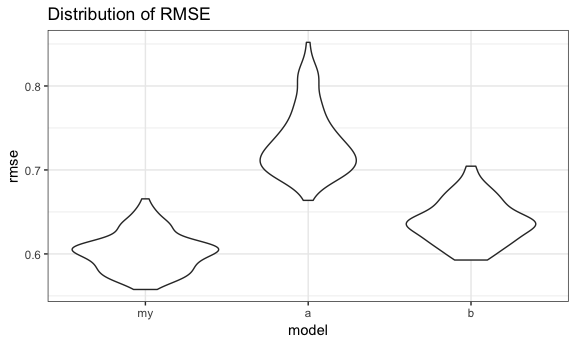

p8105\_hw6\_bs3142
================
Bingyu Sun
11/19/2018

Problem 1
---------

### Data Import & Cleaning

-   **Create a city\_state variable (e.g. “Baltimore, MD”), and a binary variable indicating whether the homicide is solved. Omit cities Dallas, TX; Phoenix, AZ; and Kansas City, MO – these don’t report victim race. Also omit Tulsa, AL – this is a data entry mistake. Modifiy victim\_race to have categories white and non-white, with white as the reference category. Be sure that victim\_age is numeric.**

``` r
homicides_data =
  read_csv("./data/homicide-data.csv", na = c("", "NA", "Unknown")) %>%
  na.omit() %>%
  mutate(city_state = str_c(city, state, sep = ", ")) %>%
  filter(!(city_state %in% c("Dallas, TX", "Phoenix, AZ", "Kansas City, MO", "Tulsa, AL"))) %>%
  mutate(
    resolved = as.numeric(disposition == "Closed by arrest"),
    victim_age = as.numeric(victim_age),
    victim_race = ifelse(victim_race == "White", "white", "non-white"),
    victim_race = fct_relevel(victim_race, "white")
  )
## Parsed with column specification:
## cols(
##   uid = col_character(),
##   reported_date = col_integer(),
##   victim_last = col_character(),
##   victim_first = col_character(),
##   victim_race = col_character(),
##   victim_age = col_integer(),
##   victim_sex = col_character(),
##   city = col_character(),
##   state = col_character(),
##   lat = col_double(),
##   lon = col_double(),
##   disposition = col_character()
## )
```

### Q & A

**1. For the city of Baltimore, MD, use the glm function to fit a logistic regression with resolved vs unresolved as the outcome and victim age, sex and race (as just defined) as predictors. Save the output of glm as an R object; apply the broom::tidy to this object.**

``` r
fit_logistic_baltimore =
  homicides_data %>%
  filter(city_state == "Baltimore, MD") %>%
  select(resolved, victim_age, victim_sex, victim_race) %>%
  glm(resolved ~ victim_age + victim_sex + victim_race, data = ., family = binomial()) 

fit_logistic_baltimore %>%
  broom::tidy()
## # A tibble: 4 x 5
##   term                 estimate std.error statistic  p.value
##   <chr>                   <dbl>     <dbl>     <dbl>    <dbl>
## 1 (Intercept)           1.19      0.235        5.06 4.30e- 7
## 2 victim_age           -0.00699   0.00326     -2.14 3.22e- 2
## 3 victim_sexMale       -0.888     0.136       -6.53 6.80e-11
## 4 victim_racenon-white -0.820     0.175       -4.69 2.68e- 6
```

**2. Obtain the estimate and confidence interval of the adjusted odds ratio for solving homicides comparing non-white victims to white victims keeping all other variables fixed.**

``` r
fit_logistic_baltimore %>%
  broom::tidy(conf.int = TRUE) %>%
  mutate(OR = exp(estimate)) %>%
  select(term, OR, log_OR = estimate, starts_with("conf")) %>%
  filter(term == "victim_racenon-white")
## # A tibble: 1 x 5
##   term                    OR log_OR conf.low conf.high
##   <chr>                <dbl>  <dbl>    <dbl>     <dbl>
## 1 victim_racenon-white 0.441 -0.820    -1.16    -0.479
```

**3. Now run glm for each of the cities in your dataset, and extract the adjusted odds ratio (and CI) for solving homicides comparing non-white victims to white victims. Do this within a “tidy” pipeline, making use of purrr::map, list columns, and unnest as necessary to create a dataframe with estimated ORs and CIs for each city.**

``` r
tidy = function(df) {
  broom::tidy(df, conf.int = TRUE)
}

homicides_statistics =
  homicides_data %>%
  group_by(city_state) %>%
  nest() %>% 
  mutate(
    fit_model = map(.x = data, ~glm(resolved ~ victim_age + victim_sex + victim_race, data = .x, family = binomial())),
    fit_model = map(fit_model, tidy)
    ) %>%
  select(-data) %>%
  unnest() %>%
  mutate(OR = exp(estimate),
         conf.low = exp(conf.low),
         conf.high = exp(conf.high)) %>%
  select(city_state, term, OR, starts_with("conf")) %>%
  filter(term == "victim_racenon-white")
```

**4. Create a plot that shows the estimated ORs and CIs for each city. Organize cities according to estimated OR, and comment on the plot.**

``` r
homicides_statistics %>%
  mutate(city_state = fct_reorder(city_state, OR)) %>%
  ggplot(aes(x = city_state, y = OR)) +
  geom_point() +
  geom_errorbar(aes(ymin = conf.low, ymax = conf.high)) + 
  theme(axis.text.x = element_text(angle = 90, hjust = 1))
```


**Comment:**

Problem 2
---------

### Data Import & Cleaning

-   **Load and clean the data for regression analysis (i.e. convert numeric to factor where appropriate, check for missing data, etc.).**

``` r
birthweight_data =
  read_csv("./data/birthweight.csv", col_types = "dddddddddddddddddddd") %>%
  mutate(babysex = as.factor(babysex),
         frace = as.factor(frace),
         malform = as.factor(malform),
         mrace = as.factor(mrace))

str(birthweight_data)
## Classes 'tbl_df', 'tbl' and 'data.frame':    4342 obs. of  20 variables:
##  $ babysex : Factor w/ 2 levels "1","2": 2 1 2 1 2 1 2 2 1 1 ...
##  $ bhead   : num  34 34 36 34 34 33 33 33 36 33 ...
##  $ blength : num  51 48 50 52 52 52 46 49 52 50 ...
##  $ bwt     : num  3629 3062 3345 3062 3374 ...
##  $ delwt   : num  177 156 148 157 156 129 126 140 146 169 ...
##  $ fincome : num  35 65 85 55 5 55 96 5 85 75 ...
##  $ frace   : Factor w/ 5 levels "1","2","3","4",..: 1 2 1 1 1 1 2 1 1 2 ...
##  $ gaweeks : num  39.9 25.9 39.9 40 41.6 ...
##  $ malform : Factor w/ 2 levels "0","1": 1 1 1 1 1 1 1 1 1 1 ...
##  $ menarche: num  13 14 12 14 13 12 14 12 11 12 ...
##  $ mheight : num  63 65 64 64 66 66 72 62 61 64 ...
##  $ momage  : num  36 25 29 18 20 23 29 19 13 19 ...
##  $ mrace   : Factor w/ 4 levels "1","2","3","4": 1 2 1 1 1 1 2 1 1 2 ...
##  $ parity  : num  3 0 0 0 0 0 0 0 0 0 ...
##  $ pnumlbw : num  0 0 0 0 0 0 0 0 0 0 ...
##  $ pnumsga : num  0 0 0 0 0 0 0 0 0 0 ...
##  $ ppbmi   : num  26.3 21.3 23.6 21.8 21 ...
##  $ ppwt    : num  148 128 137 127 130 115 105 119 105 145 ...
##  $ smoken  : num  0 0 1 10 1 0 0 0 0 4 ...
##  $ wtgain  : num  29 28 11 30 26 14 21 21 41 24 ...
skimr::skim(birthweight_data)
## Skim summary statistics
##  n obs: 4342 
##  n variables: 20 
## 
## ── Variable type:factor ────────────────────────────────────────────────────────────
##  variable missing complete    n n_unique                      top_counts
##   babysex       0     4342 4342        2         1: 2230, 2: 2112, NA: 0
##     frace       0     4342 4342        5 1: 2123, 2: 1911, 4: 248, 3: 46
##   malform       0     4342 4342        2           0: 4327, 1: 15, NA: 0
##     mrace       0     4342 4342        4 1: 2147, 2: 1909, 4: 243, 3: 43
##  ordered
##    FALSE
##    FALSE
##    FALSE
##    FALSE
## 
## ── Variable type:numeric ───────────────────────────────────────────────────────────
##  variable missing complete    n      mean     sd     p0     p25     p50
##     bhead       0     4342 4342   33.65     1.62  21      33      34   
##   blength       0     4342 4342   49.75     2.72  20      48      50   
##       bwt       0     4342 4342 3114.4    512.15 595    2807    3132.5 
##     delwt       0     4342 4342  145.57    22.21  86     131     143   
##   fincome       0     4342 4342   44.11    25.98   0      25      35   
##   gaweeks       0     4342 4342   39.43     3.15  17.7    38.3    39.9 
##  menarche       0     4342 4342   12.51     1.48   0      12      12   
##   mheight       0     4342 4342   63.49     2.66  48      62      63   
##    momage       0     4342 4342   20.3      3.88  12      18      20   
##    parity       0     4342 4342    0.0023   0.1    0       0       0   
##   pnumlbw       0     4342 4342    0        0      0       0       0   
##   pnumsga       0     4342 4342    0        0      0       0       0   
##     ppbmi       0     4342 4342   21.57     3.18  13.07   19.53   21.03
##      ppwt       0     4342 4342  123.49    20.16  70     110     120   
##    smoken       0     4342 4342    4.15     7.41   0       0       0   
##    wtgain       0     4342 4342   22.08    10.94 -46      15      22   
##      p75   p100     hist
##    35      41   ▁▁▁▁▅▇▁▁
##    51      63   ▁▁▁▁▁▇▁▁
##  3459    4791   ▁▁▁▃▇▇▂▁
##   157     334   ▁▇▅▁▁▁▁▁
##    65      96   ▁▂▇▂▂▂▁▃
##    41.1    51.3 ▁▁▁▁▃▇▁▁
##    13      19   ▁▁▁▁▂▇▁▁
##    65      77   ▁▁▁▅▇▂▁▁
##    22      44   ▂▇▅▂▁▁▁▁
##     0       6   ▇▁▁▁▁▁▁▁
##     0       0   ▁▁▁▇▁▁▁▁
##     0       0   ▁▁▁▇▁▁▁▁
##    22.91   46.1 ▁▇▅▁▁▁▁▁
##   134     287   ▁▇▆▁▁▁▁▁
##     5      60   ▇▁▁▁▁▁▁▁
##    28      89   ▁▁▁▇▇▁▁▁
```

**Comment:** There is no missing value in the dataset.

### Q & A

**1. Propose a regression model for birthweight. This model may be based on a hypothesized structure for the factors that underly birthweight, on a data-driven model-building process, or a combination of the two. Describe your modeling process and show a plot of model residuals against fitted values – use add\_predictions and add\_residuals in making this plot.**

\*\*Look at the <data:**>

``` r
birthweight_data %>%
  select(-babysex, -frace, -malform, -mrace, -pnumlbw, -pnumsga) %>%
  cor()
##                 bhead     blength          bwt        delwt      fincome
## bhead     1.000000000  0.63045480  0.747106776  0.214370719  0.115699146
## blength   0.630454800  1.00000000  0.743450753  0.229149444  0.078745057
## bwt       0.747106776  0.74345075  1.000000000  0.287889306  0.154571511
## delwt     0.214370719  0.22914944  0.287889306  1.000000000  0.034994354
## fincome   0.115699146  0.07874506  0.154571511  0.034994354  1.000000000
## gaweeks   0.378456488  0.35926367  0.412183348  0.124278465  0.106677673
## menarche -0.003016051 -0.02106739 -0.024424664 -0.085940103 -0.003535085
## mheight   0.116948174  0.16025985  0.192163204  0.411257622  0.131018596
## momage    0.108081296  0.08016031  0.135773400  0.074040925  0.323114207
## parity   -0.020039523 -0.03247008 -0.008374112 -0.004709123 -0.025942406
## ppbmi     0.086556495  0.07401577  0.093945729  0.720504055 -0.020189000
## ppwt      0.136608829  0.14860464  0.182891964  0.870913274  0.047252637
## smoken   -0.053947231 -0.06562883 -0.075627807  0.048612734  0.077943047
## wtgain    0.183333740  0.19122376  0.247252588  0.424788310 -0.016037706
##                gaweeks      menarche     mheight      momage       parity
## bhead     0.3784564882 -0.0030160515  0.11694817  0.10808130 -0.020039523
## blength   0.3592636747 -0.0210673863  0.16025985  0.08016031 -0.032470081
## bwt       0.4121833483 -0.0244246642  0.19216320  0.13577340 -0.008374112
## delwt     0.1242784648 -0.0859401032  0.41125762  0.07404092 -0.004709123
## fincome   0.1066776727 -0.0035350852  0.13101860  0.32311421 -0.025942406
## gaweeks   1.0000000000 -0.0004362693  0.06213774  0.11390983 -0.079658854
## menarche -0.0004362693  1.0000000000  0.07411557  0.17603797  0.019476194
## mheight   0.0621377387  0.0741155687  1.00000000  0.10904804 -0.013423739
## momage    0.1139098271  0.1760379749  0.10904804  1.00000000  0.051954243
## parity   -0.0796588545  0.0194761938 -0.01342374  0.05195424  1.000000000
## ppbmi     0.0273358740 -0.1218260802 -0.10073775  0.08124512 -0.005926674
## ppwt      0.0564730379 -0.0704995875  0.42668724  0.12959210 -0.011202947
## smoken    0.0362116820  0.0163746450  0.06098352  0.07545435 -0.005575698
## wtgain    0.1481459581 -0.0445137226  0.04847893 -0.08848760  0.011081927
##                 ppbmi        ppwt       smoken      wtgain
## bhead     0.086556495  0.13660883 -0.053947231  0.18333374
## blength   0.074015773  0.14860464 -0.065628829  0.19122376
## bwt       0.093945729  0.18289196 -0.075627807  0.24725259
## delwt     0.720504055  0.87091327  0.048612734  0.42478831
## fincome  -0.020189000  0.04725264  0.077943047 -0.01603771
## gaweeks   0.027335874  0.05647304  0.036211682  0.14814596
## menarche -0.121826080 -0.07049959  0.016374645 -0.04451372
## mheight  -0.100737749  0.42668724  0.060983516  0.04847893
## momage    0.081245123  0.12959210  0.075454350 -0.08848760
## parity   -0.005926674 -0.01120295 -0.005575698  0.01108193
## ppbmi     1.000000000  0.85331676  0.007022980 -0.10992958
## ppwt      0.853316763  1.00000000  0.038854748 -0.07494032
## smoken    0.007022980  0.03885475  1.000000000  0.02706577
## wtgain   -0.109929577 -0.07494032  0.027065774  1.00000000
```

-   Baby's head circumference at birth (bhead), baby's length at birth (blength), and baby's birth weight (bwt) are highly correlated (&gt;0.7).

-   Mother's pre-pregnancy BMI (ppbmi), mother's pre-pregnancy weight (ppwt), and mother's weight at delivery (delwt) are highly correlated (&gt;0.7).

``` r
birthweight_clean =
  birthweight_data %>%
  select(-blength, -ppbmi, -ppwt, -pnumlbw, -pnumsga) %>%
  select(bwt, everything())
```

**Look at outcome distribution**

``` r
birthweight_clean %>%
  select(bwt) %>%
  ggplot(aes(y = bwt)) + geom_boxplot()
```



``` r

birthweight_clean %>%
  select(bwt) %>%
  ggplot(aes(x = bwt)) + geom_histogram()
## `stat_bin()` using `bins = 30`. Pick better value with `binwidth`.
```


**Use stepwise approach to get some models**

``` r
fit_all = lm(bwt ~ ., data = birthweight_clean)

step(fit_all, direction = 'backward')
## Start:  AIC=49913.51
## bwt ~ babysex + bhead + delwt + fincome + frace + gaweeks + malform + 
##     menarche + mheight + momage + mrace + parity + smoken + wtgain
## 
##            Df Sum of Sq       RSS   AIC
## - frace     4     69480 422860419 49906
## - momage    1       950 422791889 49912
## - fincome   1      2080 422793018 49912
## - malform   1     15477 422806415 49912
## <none>                  422790938 49914
## - parity    1    260991 423051929 49914
## - menarche  1    292147 423083085 49915
## - babysex   1    498735 423289674 49917
## - mrace     3   1070424 423861363 49918
## - mheight   1   3251715 426042654 49945
## - delwt     1   4789514 427580452 49960
## - wtgain    1   5039087 427830025 49963
## - smoken    1   9708232 432499171 50010
## - gaweeks   1  14121163 436912102 50054
## - bhead     1 338144511 760935450 52463
## 
## Step:  AIC=49906.22
## bwt ~ babysex + bhead + delwt + fincome + gaweeks + malform + 
##     menarche + mheight + momage + mrace + parity + smoken + wtgain
## 
##            Df Sum of Sq       RSS   AIC
## - momage    1      1395 422861813 49904
## - fincome   1      2798 422863217 49904
## - malform   1     15219 422875638 49904
## <none>                  422860419 49906
## - parity    1    261253 423121672 49907
## - menarche  1    299179 423159598 49907
## - babysex   1    498664 423359083 49909
## - mheight   1   3278009 426138428 49938
## - delwt     1   4767297 427627716 49953
## - wtgain    1   5054901 427915320 49956
## - smoken    1   9706988 432567407 50003
## - gaweeks   1  14133450 436993869 50047
## - mrace     3  21688991 444549409 50117
## - bhead     1 338661002 761521421 52459
## 
## Step:  AIC=49904.23
## bwt ~ babysex + bhead + delwt + fincome + gaweeks + malform + 
##     menarche + mheight + mrace + parity + smoken + wtgain
## 
##            Df Sum of Sq       RSS   AIC
## - fincome   1      3914 422865728 49902
## - malform   1     15033 422876847 49902
## <none>                  422861813 49904
## - parity    1    265471 423127284 49905
## - menarche  1    302318 423164131 49905
## - babysex   1    497538 423359352 49907
## - mheight   1   3277285 426139099 49936
## - delwt     1   4885589 427747402 49952
## - wtgain    1   5153371 428015184 49955
## - smoken    1   9708926 432570739 50001
## - gaweeks   1  14190127 437051940 50046
## - mrace     3  23081574 445943388 50129
## - bhead     1 338667510 761529324 52457
## 
## Step:  AIC=49902.27
## bwt ~ babysex + bhead + delwt + gaweeks + malform + menarche + 
##     mheight + mrace + parity + smoken + wtgain
## 
##            Df Sum of Sq       RSS   AIC
## - malform   1     15291 422881019 49900
## <none>                  422865728 49902
## - parity    1    264316 423130044 49903
## - menarche  1    303379 423169106 49903
## - babysex   1    496590 423362317 49905
## - mheight   1   3315925 426181652 49934
## - delwt     1   4885883 427751610 49950
## - wtgain    1   5149661 428015389 49953
## - smoken    1   9724107 432589834 49999
## - gaweeks   1  14212123 437077851 50044
## - mrace     3  26913354 449779082 50164
## - bhead     1 338853780 761719507 52456
## 
## Step:  AIC=49900.43
## bwt ~ babysex + bhead + delwt + gaweeks + menarche + mheight + 
##     mrace + parity + smoken + wtgain
## 
##            Df Sum of Sq       RSS   AIC
## <none>                  422881019 49900
## - parity    1    264595 423145614 49901
## - menarche  1    302426 423183445 49902
## - babysex   1    499298 423380317 49904
## - mheight   1   3323158 426204177 49932
## - delwt     1   4884132 427765151 49948
## - wtgain    1   5138421 428019440 49951
## - smoken    1   9750552 432631571 49997
## - gaweeks   1  14225798 437106817 50042
## - mrace     3  26898188 449779207 50162
## - bhead     1 338860451 761741470 52454
## 
## Call:
## lm(formula = bwt ~ babysex + bhead + delwt + gaweeks + menarche + 
##     mheight + mrace + parity + smoken + wtgain, data = birthweight_clean)
## 
## Coefficients:
## (Intercept)     babysex2        bhead        delwt      gaweeks  
##   -5281.548       21.932      198.117        1.891       20.000  
##    menarche      mheight       mrace2       mrace3       mrace4  
##      -5.730       11.969     -174.039      -77.211     -126.190  
##      parity       smoken       wtgain  
##      76.184       -6.689        3.550
```

The stepwise approach suggests babysex, bhead, delwt, gaweeks, menarche, mheight, mrace, parity, smoken, and wtgain.

**Check Cp**

``` r
covariates_fit = data.frame(birthweight_clean)

#leaps(x = covariates_fit[,2:14], y = covariates_fit[,1], nbest=1, method="Cp") 
```

**Model**

``` r
best_fit_brithweight = lm(bwt~babysex + delwt + gaweeks + mrace + parity + smoken + mheight + wtgain + bhead + menarche, data = birthweight_clean)

birthweight_clean %>% 
  modelr::add_residuals(best_fit_brithweight) %>%
  modelr::add_predictions(best_fit_brithweight) %>%
  ggplot(aes(x = pred, y = resid)) +
  geom_point(alpha = 0.25)
```


